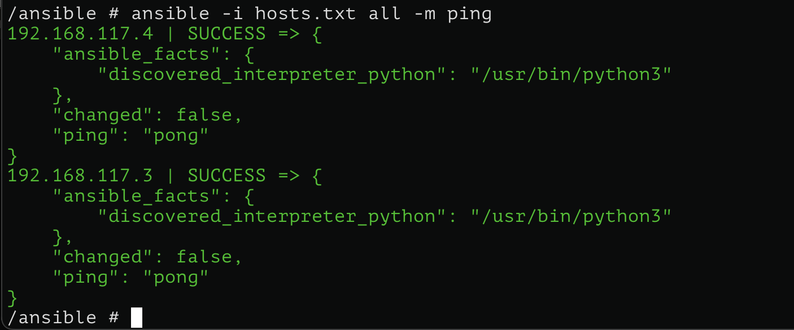
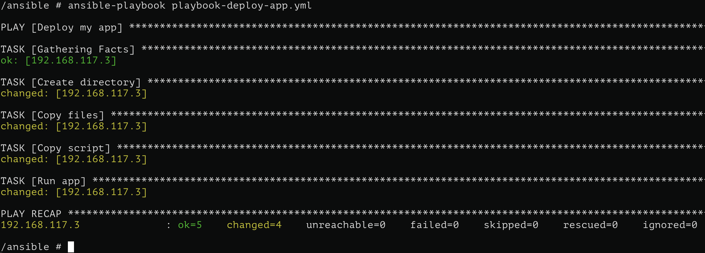
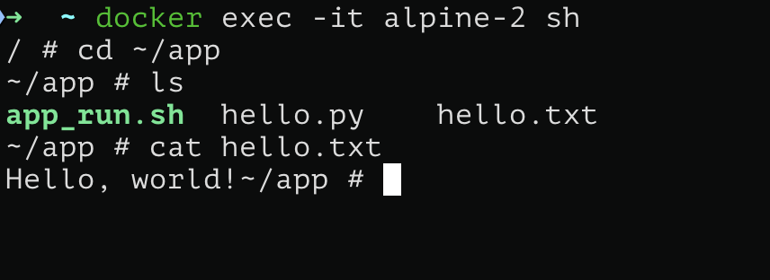
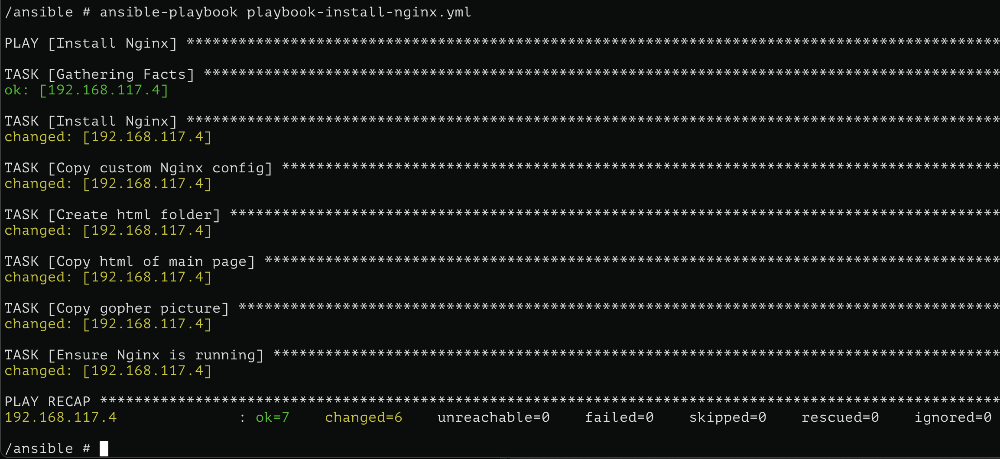
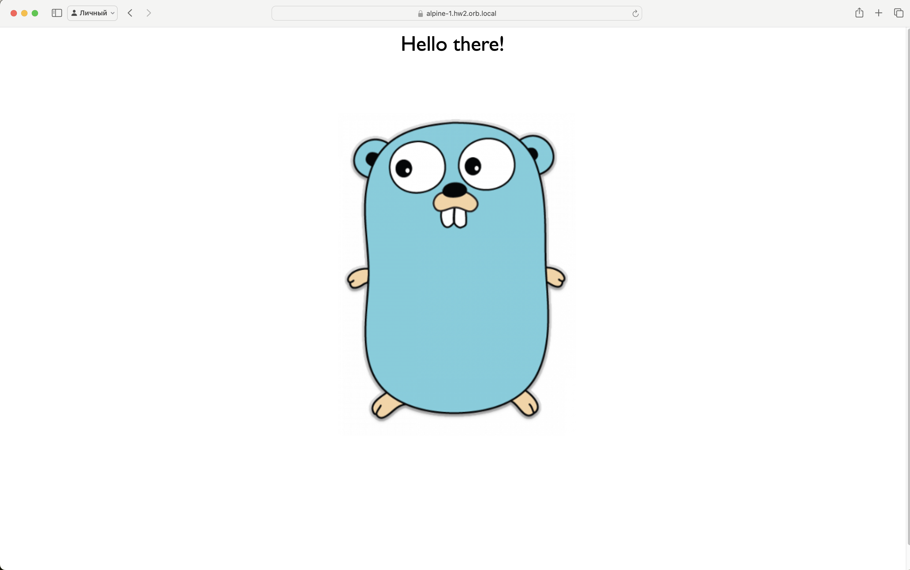

# Ansible

## Подготовка

1. Создадим Dockerfile, с помощью которого впоследствии создадим Docker Image с Linux Alpine:

```yml
# Dockerfile
FROM alpine:3.11

RUN apk add --no-cache openssh ansible git sshpass openrc vim
RUN mkdir -p ~/.ssh

CMD ["sh"]
```

```sh
docker build -t ansible-alpine .
```

2. Создадим файл `docker-compose`, с помощью которого создадим три Docker Container на базе созданного Docker Image

```yml
services:
  alpine-main:
    image: ansible-alpine
    container_name: alpine-main
    working_dir: /ansible
    volumes:
      - ./ansible:/ansible
      - ./app:/ansible/app
    networks:
      - my_net
    command: /bin/sh -c "rc-update add sshd && \
                        rc-status && \
                        touch /run/openrc/softlevel && \
                        rc-service sshd start && \
                        rc-service sshd restart && \
                        sleep infinity"

  alpine-1:
    image: ansible-alpine
    container_name: alpine-1
    networks:
      - my_net
    command: /bin/sh -c "echo 'root:123' | chpasswd && \ 
                        rc-update add sshd && \
                        rc-status && \
                        touch /run/openrc/softlevel && \
                        echo 'PermitRootLogin yes' >> /etc/ssh/sshd_config && \
                        echo 'PasswordAuthentication yes' >> /etc/ssh/sshd_config && \
                        rc-service sshd start && \
                        sleep infinity"

  alpine-2:
    image: ansible-alpine
    container_name: alpine-2
    networks:
      - my_net
    command: /bin/sh -c "echo 'root:123' | chpasswd && \ 
                        rc-update add sshd && \
                        rc-status && \
                        touch /run/openrc/softlevel && \
                        echo 'PermitRootLogin yes' >> /etc/ssh/sshd_config && \
                        echo 'PasswordAuthentication yes' >> /etc/ssh/sshd_config && \
                        rc-service sshd start && \
                        sleep infinity"

networks:
  my_net:
    driver: bridge

```

Соответственно будем заливать файл на `ansible-main` и с помощью `ansible` передавать файлы на `ansible-1` и `ansible-2`.

(Зайти в контейнер `docker exec -it ansible-main sh`)

3. На `ansible-main` cгенерируем ssh пару ключей для доступа к `ansible-1` и `ansible-2` (в `Enter file in which to save the key (/root/.ssh/id_rsa):` и `Enter passphrase (empty for no passphrase):` ничего не заполняем):

```sh
ssh-keygen -t rsa -b 2048
```

В папке ~/.ssh должны появиться `id_rsa` и `id_rsa.pub`. Копируем `id_rsa.pub` на `ansible-1` командой (`IP_ADDR` можно узнать командой `docker inspect alpine-1`)

```sh
ssh-copy-id -i ~/.ssh/id_rsa.pub root@<IP_ADDR>
```

Проверяем, что все работает: при команде

```sh
ssh -i ~/.ssh/id_rsa root@<IP_ADDR>
```

пароль больше не спрашивают и прописываем в hosts.txt `IP_ADDR` и выполняем

```sh
ansible -i hosts.txt all -m ping
```

Получаем в ответ `pong`, значит, все работает.



## Playbooks

### Деплой приложения.

В качестве приложения выберем простейший `Python`-скрипт, записывающий в файл `"Hello, world!"`,

```python
with open("hello.txt", "w") as f:
    f.write("Hello, world!")
```

а также `bash`-скрипт, запускающий его

```sh
#!/bin/bash
python3 ~/app/hello.py

```

Соответственно с помощью ansible нам надо положить python файл и bash файл на наши хосты и удаленно запустить bash-скрипт. Сделаем это в плейбуке [playbook-deploy-app.yml](ansible/playbook-deploy-app.yml).

```yml
---
- name: Deploy my app
  hosts: myapp

  tasks:
    - name: Create directory # создание директории
      file:
        path: ~/app
        state: directory

    - name: Copy files # копирование python-файла
      copy:
        src: ../app/hello.py
        dest: ~/app/hello.py

    - name: Copy script # копирование bash-скрипта запуска
      copy:
        src: ../app/app_run.sh
        dest: ~/app/app_run.sh
        mode: '0777'

    - name: Run app # запуск скопированного bash-скрипта
      command: sh ~/app/app_run.sh
```

Запускаем при помощи команды `ansible-playbook playbook-deploy-app.yml` и видим следующий вывод:



Все сработало успешно. Проверим, что файлы скопировались и скрипт запустился, для этого зайдем на хост из группы `myapp`:



### Установка и настройка Nginx

В данном примере нам необходимо установить nginx на хосты из группы nginx и удаленно настроить его (и запустить). Сделаем это в плейбуке [playbook-install-nginx.yml](ansible/playbook-install-nginx.yml).

```yml
---
- name: Install Nginx
  hosts: nginx

  tasks:
    - name: Install Nginx # установка nginx
      apk:
        name: nginx
        state: present

    - name: Copy custom Nginx config # копирование конфигурационного файла на хосты
      copy:
        src: ../Nginx/default.conf
        dest: /etc/nginx/conf.d/default.conf

    - name: Create html folder # создание новой директории, где будет лежать html-шаблон нашей страницы
      file:
        path: /var/www/html
        state: directory

    - name: Copy html of main page # копирование html-шаблона на хосты
      copy:
        src: ../Nginx/index.html
        dest: /var/www/html/index.html
     
    - name: Copy gopher picture # копирование картинки, которую будет отображать на главной странице
      copy:
        src: ../Nginx/gopher.png
        dest: /var/www/html/gopher.png

    - name: Ensure Nginx is running # запуск nginx
      service:
        name: nginx
        state: started
        enabled: yes
```

Запускаем при помощи команды `ansible-playbook playbook-deploy-app.yml` и видим следующий вывод:



Все успешно. Теперь проверим, что все работает, для этого перейдем на веб адрес нашего хоста, где развернут nginx (я делаю это в `orbstack`, он автоматически отображает домен контейнера).

