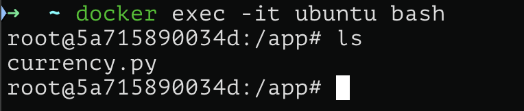
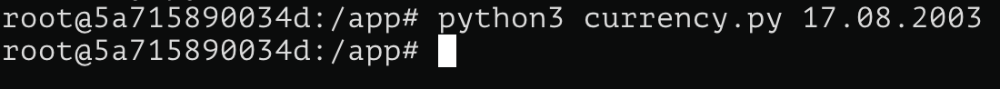
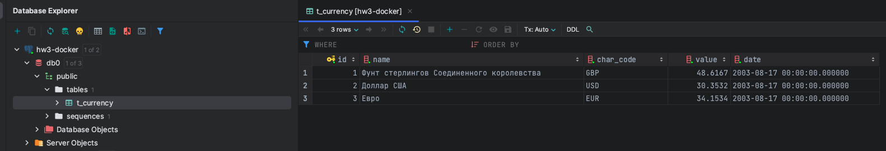
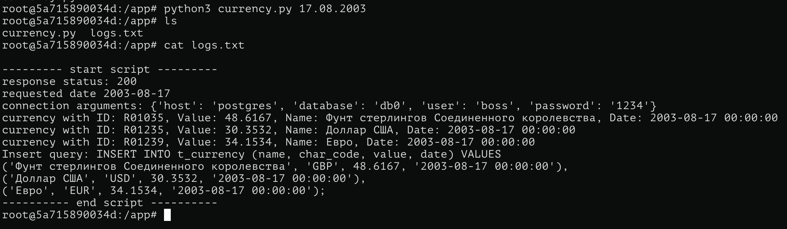

# Docker

## Приложение.

В качестве приложения буду использовать [Python-скрипт](app/currency.py), который делает GET запрос по адресу Центрального Банка РФ, для получения информации о курсе валют (`https://www.cbr.ru/scripts/XML_daily.asp?date_req=dd.mm.YYYY`). Ответ приходит в формает XML, далее мы парсим его с помощью библиотеки xml.etree.ElementTree и выбираем интересующие нас валюты: доллар США, Евро и Фунт стерлингов Соединенного Королевства. По умолчанию курс берется на `02.03.2002`, но можно передать интересующую дату с помощью аргументов командной строки.

```python
query_params = "?date_req=02.03.2002"
date = datetime.datetime.strptime("02.03.2002", "%d.%m.%Y")
if len(sys.argv) > 1:
    date = datetime.datetime.strptime(sys.argv[1], "%d.%m.%Y")
    query_params = "?date_req=" + sys.argv[1]

response = requests.get("https://www.cbr.ru/scripts/XML_daily.asp" + query_params)

root = ET.fromstring(response.content)

currencyIDs = {"R01035", "R01235", "R01239"} # USD, EUR, GBP
```

Далее из переменной окружающей среды мы берем конфигурацию для подключения к PostgeSQL (находится в одной с нами сети). Подключаемся, создаем таблицу (если не создана), в которой будем хранить историю запросов и записываем в нее полученную информацию.

```python
conn_args = { # конфигурация для подключения
    "host": "postgres",
    "database": os.environ.get("POSTGRES_DB"),
    "user": os.environ.get("POSTGRES_USER"),
    "password": os.environ.get("POSTGRES_PASSWORD"),
}

with psycopg2.connect(**conn_args) as conn:
    with conn.cursor() as cursor:
        cursor.execute( # создание таблицы, если ее нет
            """
            CREATE TABLE IF NOT EXISTS t_currency (
                id              BIGSERIAL PRIMARY KEY,
                name         TEXT               NOT NULL DEFAULT '',
                char_code TEXT               NOT NULL DEFAULT '',
                value         DECIMAL       NOT NULL DEFAULT 0.0,
                date           TIMESTAMP   NOT NULL 
            );
            """
        )

        values = []
        isFirst = True
        for valute in root.findall("Valute"):
            valute_id = valute.get("ID")
            if valute_id in currencyIDs: # поиск интересующих валют
                if not isFirst:
                    values[-1] += ","
                isFirst = False

                char_code = valute.find("CharCode").text
                value = float(valute.find("Value").text.replace(",", ".", 1))
                name = valute.find("Name").text
                values.append(f"('{name}', '{char_code}', {value}, '{date}')")

        insert_query = "INSERT INTO t_currency (name, char_code, value, date) VALUES\n" + "\n".join(values) + ";"
        logs.append("Insert query: " + insert_query)

        cursor.execute(insert_query) # запись данных в таблицу
        conn.commit()
```

Также дополнительно будем производить логгирование в файл [logs.txt](app/logs.txt).

## Развертка контейнеров

Будем использовать PostgreSQL в качестве БД и ubuntu как систему, где будем запускать приложение.

Для работы скрипта потребуются библиотеки psycopg2-binary и requests, которые укажем в [requirements.txt](requirements.txt)

```
psycopg2-binary
requests
```

image ubuntu с зависимостями соберем с помощью [Dockerfile](Dockerfile)

```sh
FROM ubuntu:latest

RUN apt-get update && apt-get install -y vim python3 python3-pip

COPY requirements.txt .
RUN pip3 install --no-cache-dir --break-system-packages -r requirements.txt

CMD ["bash"]
```

После чего поднимем контейнеры с помощью [docker-compose](docker-compose.yml) файла

```yml
services:
  postgres:
    image: postgres:latest
    container_name: postgres
    environment:
      POSTGRES_USER: boss
      POSTGRES_PASSWORD: 1234
      POSTGRES_DB: db0
    ports:
      - "5432:5432"
    volumes:
      - ./postgres_data:/var/lib/postgresql/data
    networks: # создаем БД и ubuntu в одной локальной сети
      - my_net

  ubuntu:
    image: ubuntu
    container_name: ubuntu
    working_dir: /app
    volumes:
      - ./app:/app
    environment: # передаем переменные окружения в ubuntu
      POSTGRES_USER: boss
      POSTGRES_PASSWORD: 1234
      POSTGRES_DB: db0
    command: /bin/sh -c "echo 'root:123' | chpasswd && \
                        sleep infinity"
    depends_on:
      - postgres
    networks: # создаем БД и ubuntu в одной локальной сети
      - my_net


networks:
  my_net:
    driver: bridge
```

Заходим в ubuntu командой `docker exec -it ubuntu bash`.



Запускаем python-скрипт командой (укажем дату, например, 17.08.2003).

```python
python3 currency.py 17.08.2003
```



Ошибок нет. Проверим нашу БД, видим, что данные успешно добавились:



Логи также записались корректно.

