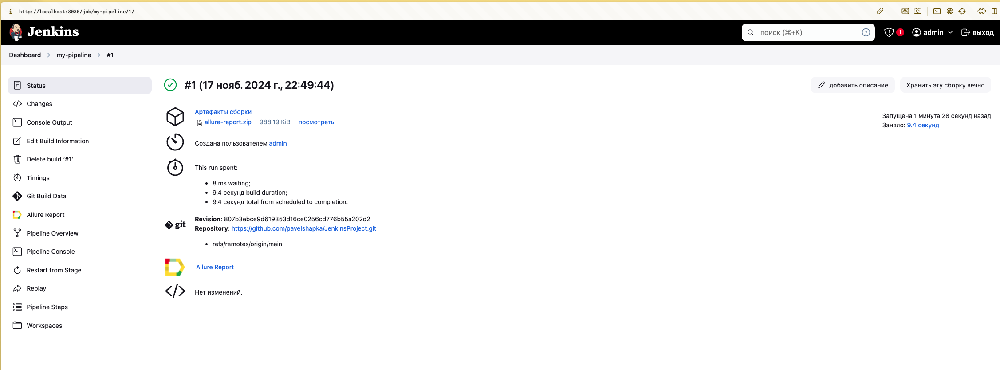

# Jenkins

## Создание docker images

Для работы нам потребуется 2 docker image: `jenkins` и `linux alpine`, который будем использовать как сервер для деплоя. Создадим их с помощью файлов [`Dockerfile`](docker/alpine_linux/Dockerfile) (`docker build -t alpine docker/alpine_linux`)

```yml
FROM alpine:3.20

RUN apk add --update --no-cache openssh ansible sshpass openrc py3-pip
RUN mkdir -p ~/.ssh

COPY requirements.txt .
RUN pip3 install --no-cache-dir --break-system-packages -r requirements.txt

CMD ["sh"]
```

и [`Dockerfile`](docker/jenkins/Dockerfile) (`docker build -t jenkins_img docker/jenkins/`)

```yml
FROM jenkins/jenkins:lts
USER root

RUN apt-get update && apt-get install -y vim python3 python3-pip python3.11-venv bash maven ansible
COPY requirements.txt .
RUN /bin/bash -c "pip install --no-cache-dir --break-system-packages -r requirements.txt"

CMD ["/usr/local/bin/jenkins.sh"]
```

Также нам понадобится контейнер с SonarQube (а с ним и БД PostgreSQL). Запустим все контейнеры с помощью [docker-compose.yml](docker-compose.yml).

```yml
services:
  alpine: # Контейнер с Alpine Linux
    image: alpine
    container_name: alpine
    networks:
      - my_net
    command: /bin/sh -c "echo 'root:123' | chpasswd && \
                        rc-update add sshd && \
                        rc-status && \
                        touch /run/openrc/softlevel && \
                        echo 'PermitRootLogin yes' >> /etc/ssh/sshd_config && \
                        echo 'PasswordAuthentication yes' >> /etc/ssh/sshd_config && \
                        rc-service sshd start && \
                        sleep infinity" # Меняем пароль root и настраиваем ssh

  jenkins: # Контейнер с Jenkins
    image: jenkins_img
    container_name: jenkins
    ports:
      - "8080:8080"
      - "50000:50000"
    volumes:
      - ./jenkins_home:/var/jenkins_home
      - ./ansible:/var/lib/ansible
    user: root
    networks:
      - my_net

  sonarqube: # Контейнер с SonarQube
    image: sonarqube:community
    container_name: sonarqube
    depends_on:
      - db
    environment:
      SONAR_JDBC_URL: jdbc:postgresql://db:5432/sonar
      SONAR_JDBC_USERNAME: sonar
      SONAR_JDBC_PASSWORD: sonar
    volumes:
      - ./sonarqube/sonarqube_data:/opt/sonarqube/data
      - ./sonarqube/sonarqube_extensions:/opt/sonarqube/extensions
      - ./sonarqube/sonarqube_logs:/opt/sonarqube/logs
    ports:
      - "9000:9000"
    networks:
      - my_net

  db: # БД для SonarQube
    image: postgres:12
    container_name: postgresql
    environment:
      POSTGRES_USER: sonar
      POSTGRES_PASSWORD: sonar
    volumes:
      - ./sonarqube/postgresql:/var/lib/postgresql
      - ./sonarqube/postgresql_data:/var/lib/postgresql/data
    networks:
      - my_net

networks: # Все в одной локальной сети
  my_net:
    driver: bridge
```

## Первичная настройка 

1. **Ansible**

    Заранее создадим пару ключей ssh для использования `ansible` (в процессе деплоя):

    ```sh
    ssh-keygen -t rsa -b 2048
    ssh-copy-id -i ~/.ssh/id_rsa.pub root@alpine
    ```

    Создаем папку [ansible](ansible) и прописываем в ней все, что нужно: [ansible.cfg](ansible/ansible.cfg), [hosts.txt](ansible/hosts.txt) и [playbook.yml](ansible/playbook.yml)

    ```yml
    ---
    - name: Deploy app
    hosts: all

    tasks:
        - name: Create directory
        file:
            path: ~/app
            state: directory

        - name: Copy app
        copy:
            src: "{{ repo_path }}/app/" # repo_path - переменная, которую передадим при запуске плейбука
            dest: ~/app/
        

        - name: Run app
        command: sh ~/app/app_run.sh
    ```

2. **SonarQube**

    Переходим в [SonarQube](http://localhost:9000), авторизуемся (user: admin, password: admin) далее Administration $\rightarrow$ Security $\rightarrow$ Users. Нажимаем на 3 точки в столбце Tokens

    

    Name: jenkins, Expires in: No expiration, нажимаем Generate и копируем токен. У меня это squ_8a8e145f6f1ea7b5dac64408651b9860dd2d5225.

    


3. **Jenkins**

    Переходим в [Jenkins](http://localhost:8080), достаем пароль из папки `var/jenkins_home/secrets/initialAdminPassword`

    ```sh
    docker exec -it jenkins bash
    cat var/jenkins_home/secrets/initialAdminPassword
    ```

    и вставляем его на сайт. Нажимаем Install Suggested Plugins $\rightarrow$ Skip and continue as admin $\rightarrow$ Save and Finish $\rightarrow$ Start using Jenkins.

    Далее переходим в Настроить Jenkins $\rightarrow$ Plugins $\rightarrow$ Abailable plugins.

    Устанавливаем `SonarQube Scanner` и `Allure`.

    

    Далее переходим в Настроить Jenkins $\rightarrow$ System, ищем блок SonarQube servers, ставим галочку на Environment variables, Server URL: http://<IP_ADDR_OF_SONARCUBE>:9000, Server authentication token - жмем Add $\rightarrow$ Jenkins Kind: Secret text, Secret: squ_8a8e145f6f1ea7b5dac64408651b9860dd2d5225, ID: jenkins-sonar, Description: jenkins-sonar и жмем Add.

    
    

    Далее переходим в Настроить Jenkins $\rightarrow$ Tools. Добавляем Maven

    

    и Allure, жмем Сохранить.

    

4. **Проект**

    Создаем проект, на котором будем проверять работоспособность всего. Я выбрал в качестве [проекта](app/app.py) Python реализацию классов `Calculator` и `String_builder`

    ```python
    from typing import Self

    class Calculator():
        def __init__(self) -> None:
            pass

        def add(self, a: float, b: float) -> float:
            return a + b

        def sub(self, a: float, b: float) -> float:
            return a - b

        def mul(self, a: float, b: float) -> float:
            return a * b
        
    class String_builder():
        def __init__(self, buffer: None | str = None) -> None:
            if buffer is None:
                buffer = ""
            self.buffer = [buffer]

        def add_after(self, new: str) -> Self:
            self.buffer.append(new)
            return self

        def add_before(self, new: str)-> Self:
            self.buffer = [new] + self.buffer
            return self

        def build_string(self) -> str:
            return ''.join(self.buffer)
    
    if __name__ == "__main__":
        with open("run_check.txt", "w") as f:
            f.write(String_builder().add_after("World!").add_before("Hello, ").build_string())
    ```

    и [тесты](tests) к ним.

    ```python
    import unittest
    import allure
    from app import app


    @allure.feature('Тест калькулятора')
    class Test_calculator(unittest.TestCase):
        def setUp(self) -> None:
            self.calculator = app.Calculator()
        
        def test_add(self) -> None:
            self.assertEqual(self.calculator.add(5., 7.), 12.)

        def test_sub(self) -> None:
            self.assertEqual(self.calculator.sub(5., 7.), -2.)

        def test_mul(self) -> None:
            self.assertEqual(self.calculator.mul(5., 7.), 35.)

    if __name__ == "__main__":
        unittest.main()
    ```

    ```python
    import unittest
    import allure
    from app import app


    @allure.feature('Тест конструктора строк')
    class Test_string_builder(unittest.TestCase):
        def setUp(self) -> None:
            self.string_builder = app.String_builder()
        
        def test_add(self) -> None:
            self.string_builder.add_after("Hello")
            self.assertEqual(self.string_builder.add_after(", World!").build_string(), "Hello, World!")

        def test_sub(self) -> None:
            self.string_builder.add_after("Hello")
            self.assertEqual(self.string_builder.add_before(", World!").build_string(), ", World!Hello")

    if __name__ == "__main__":
        unittest.main()
    ```

    Создаем [скрипт](app/app_run.sh) запуска нашего приложения

    ```sh
    #!/bin/bash
    python3 ~/app/app.py
    ```

    Добавим в проект [pom.xml](pom.xml) для корректной работы SonarQube.

    ```xml
    <project xmlns="http://maven.apache.org/POM/4.0.0"
            xmlns:xsi="http://www.w3.org/2001/XMLSchema-instance"
            xsi:schemaLocation="http://maven.apache.org/POM/4.0.0 http://maven.apache.org/xsd/maven-4.0.0.xsd">
        <modelVersion>4.0.0</modelVersion>
        <groupId>com.example</groupId>
        <artifactId>Calculator-StringBuilder</artifactId>
        <version>1.0-SNAPSHOT</version>
        <packaging>pom</packaging>

        <properties>
            <sonar.projectKey>PyApp</sonar.projectKey>
            <sonar.projectName>Python Calculator and StringBuilder</sonar.projectName>
            <sonar.language>py</sonar.language>
            <sonar.sources>app</sonar.sources>
            <sonar.tests>tests</sonar.tests>
            <sonar.python.coverage.reportPaths>coverage.xml</sonar.python.coverage.reportPaths> <!-- Файл, который сгенерируется позже с помощью команды pytest tests --alluredir=allure-results --cov=app --cov-report xml:coverage.xml -->
            <sonar.python.version>3.11.2</sonar.python.version>
        </properties>

        <build>
            <plugins>
                <plugin>
                    <groupId>org.sonarsource.scanner.maven</groupId>
                    <artifactId>sonar-maven-plugin</artifactId>
                    <version>4.0.0.4121</version>
                </plugin>
            </plugins>
        </build>
    </project>
    ```

4. **Github**

    Создаем тестовый репозиторий в Git, у меня он [тут](https://github.com/pavelshapka/JenkinsProject/tree/main) и пушим туда наш проект.

    

## Jenkins Pipeline

Переходим в Создать Item $\rightarrow$ Pipeline + Название $\rightarrow$ Ок. Ставим галочку GitJub project и вставляем URL репозитория


В поле Script вставляем код из [Jenkins-файла](Jenkinsfile)

```groovy
pipeline {
    agent any

    stages {

        stage('Clone Repository') { // Клонирование репозитория
            steps {
                git branch: 'main', url: 'https://github.com/pavelshapka/JenkinsProject.git'
            }
        }

        stage('Test') { // Прогон тестов, сохранение allure результата и генерация coverage.xml для последующего анализа покрытия тестам в SonarQube
            steps {
                sh "pytest tests --cov=app --cov-report xml:coverage.xml --alluredir=allure-results || true"
            }
        }

        stage('Scan') { // Анализ кода с помощью SonarQube
            steps {
                withSonarQubeEnv('SonarQube') {
                    tool name: 'Maven', type: 'maven'
                    sh 'mvn clean sonar:sonar'
                }
            }
        }

        stage('Reports') { // Формирование Allure отчета
            steps {
                allure([
                reportBuildPolicy: 'ALWAYS',
                results: [[path: 'report']]
                ])
            }
        }

        stage('Deploy') { // Деплой приложения с помощью Ansible
            steps {
                sh "cd /var/lib/ansible && ansible-playbook -i hosts.txt playbook-deploy.yml --extra-vars repo_path=${env.WORKSPACE}"     
            }
        }

    }
    post {
        always {
            echo 'Pipeline finish!'
        }
    }
}
```

Нажимаем сохранить и собрать сейчас. Видим, что задача выполнилась успешно. Логи сохраним в [файл](<logs/My Pipeline Console.txt>)



Можем перейти по ссылке Allure Result:


В логах можем найти ссылку на результаты SonarQube:


Наконец, проверим, что приложение задеплоилось на сервер и запустилось (должен создаться файлик `run_check.txt`).

```sh
docker exec -it alpine sh
cat ~/check.txt
```


То есть все сработало корректно.