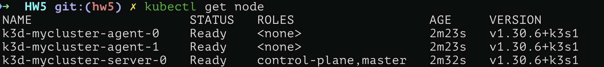
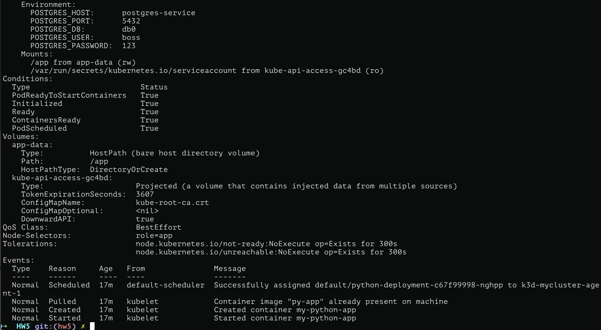

# Kubernetes

## Приложение

В качестве приложения возьмем приложение из 3 ДЗ. Оно состоит из python скрипта, который ходит на сайт Центробанка РФ и получает информацию о курсе валют на заданную дату, а затем сохраняет это в PostgreSQL БД.

```python
import requests, psycopg2, os, sys, datetime
import xml.etree.ElementTree as ET

logs = []
query_params = "?date_req=02.03.2002"
date = datetime.datetime.strptime("02.03.2002", "%d.%m.%Y")
if len(sys.argv) > 1:
    date = datetime.datetime.strptime(sys.argv[1], "%d.%m.%Y")
    query_params = "?date_req=" + sys.argv[1]

response = requests.get("https://www.cbr.ru/scripts/XML_daily.asp" + query_params)
logs.append("response status: " + str(response.status_code))

root = ET.fromstring(response.content)
logs.append(f"requested date {date.date()}")

currencyIDs = {"R01035", "R01235", "R01239"} # USD, EUR, GBP

conn_args = {
    "host": os.environ.get("POSTGRES_HOST"),
    "port": os.environ.get("POSTGRES_PORT"),
    "dbname": os.environ.get("POSTGRES_DB"),
    "user": os.environ.get("POSTGRES_USER"),
    "password": os.environ.get("POSTGRES_PASSWORD"),
}
logs.append("connection arguments: " + str(conn_args))

with psycopg2.connect(**conn_args) as conn:
    with conn.cursor() as cursor:
        cursor.execute(
            """
            CREATE TABLE IF NOT EXISTS t_currency (
                id              BIGSERIAL    PRIMARY KEY,
                name         TEXT               NOT NULL DEFAULT '',
                char_code TEXT               NOT NULL DEFAULT '',
                value         DECIMAL       NOT NULL DEFAULT 0.0,
                date           TIMESTAMP   NOT NULL 
            );
            """
        )

        values = []
        isFirst = True
        for valute in root.findall("Valute"):
            valute_id = valute.get("ID")
            if valute_id in currencyIDs:
                if not isFirst:
                    values[-1] += ","
                isFirst = False
                
                char_code = valute.find("CharCode").text
                value = float(valute.find("Value").text.replace(",", ".", 1))
                name = valute.find("Name").text
                values.append(f"('{name}', '{char_code}', {value}, '{date}')")

                logs.append(f"currency with ID: {valute_id}, Value: {value}, Name: {name}, Date: {date}")

        insert_query = "INSERT INTO t_currency (name, char_code, value, date) VALUES\n" + "\n".join(values) + ";"
        logs.append("Insert query: " + insert_query)

        cursor.execute(insert_query)
        conn.commit()

with open("logs.txt", "a") as f:
    f.write("\n--------- start script ---------\n")
    f.write("\n".join(logs))
    f.write("\n---------- end script ----------\n")
```

## Архитектура

Расположим наше приложение на кластере, состоящем из 1 master-ноды и 2-х worker-нод, на каждой worker-ноде по 1 поду с частями нашего приложения (на 0-й ноде располагается под с PostgeSQL, на 1-й ноде - под с самим скриптом). Создим кластер с помощью `k3d` командой


```sh
k3d cluster create mycluster \
    --agents 2 \
    --k3s-node-label role=database@agent:0 \
    --k3s-node-label role=app@agent:1 \
    --volume $(pwd)/app:/app@agent:1 && \
k3d image import py-app --cluster mycluster
```

Здесь мы создали кластер с именем `mycluster`, 2-мя worker-нодами, 0-й worker ноде присвоили роль database, а 1-й - app (нужно для последующего использования `nodeSelector`), а также сделали volume с `./app` на нашем компьютере до `/app` на 1-й ноде.  Далее (собрав заранее docker image нашего скрипта, мы загрузили его на все ноды).

Проверим результат командами 

```sh
kubectl get node
```



```sh
docker exec k3d-mycluster-agent-1 crictl images
```


Видим, что ноды работают и image установлен на 1-ю ноду.

## Деплой приложения

1. **Развертывание PostgreSQL**

    Развертывать PostgeSQL будем с помощью [манифеста](manifests/postgres_deployment.yaml):

    ```yaml
    apiVersion: apps/v1
    kind: Deployment
    metadata:
    name: postgres-deployment
    labels:
        app: postgres
    spec:
        replicas: 1
        selector:
            matchLabels:
                app: postgres # Deployment будет работать только с подами, у которых есть метка "app: postgres"
        template:
            metadata:
            labels:
                app: postgres
            spec:
                nodeSelector:
                    role: database # Deployment будет размещать поды только на нодах с меткой `database`
                containers:
                    - name: postgres
                      image: postgres:12
                      env:
                          - name: POSTGRES_USER
                            value: boss
                          - name: POSTGRES_PASSWORD
                            value: "123"
                          - name: POSTGRES_DB
                            value: db0
                      ports:
                          - containerPort: 5432
                      volumeMounts:
                          - mountPath: /var/lib/postgresql/data
                      name: postgres-data
                volumes:
                    - name: postgres-data
                      hostPath:
                          path: /var/lib/postgresql/data
                          type: DirectoryOrCreate
    ---
    apiVersion: v1
    kind: Service
    metadata:
        name: postgres-service
    spec:
        selector:
            app: postgres # Service будет взаимодействовать с подами, имеющим метку `app: postgres`
        ports:
            - protocol: TCP
              port: 5432 # Порт у сущности service
              targetPort: 5432 # Порт на поде
        type: ClusterIP
    ```

    Он состоит из двух частей:
    
    1. **Deployment**
        
        Описывает набор подов (и контейнеров в них), которые необходимо запустить на кластере. Deployment используется для автоскейлинга, для легкого обновления image'й на подах, балансирует поды на разные ноды кластера. То есть это инструмент для удобного и эффективного управления несколькими подами. Для Deployment PostgeSQL мы указываем его `name: postgres-deployment`, присваиваем ему метку `app: postgres`. Далее в блоке `template` идет описание подов, которые мы хотим запустить. В нашем случае это 1 под с меткой `app: postgres`. Наконец, `containers` блок описания контейнров, которые хотим запустить (аналог docker-compose). Хотим, чтобы даже после смерти пода, мы могли увидеть информацию, которую он производил в процессе работы, для этого делаем `volumeMounts` между папками `mountPath: /var/lib/postgresql/data` на поде и `hostPath: path: /var/lib/postgresql/data` на ноде. Поля блока `containers` полностью дублируют соответствующий docker-compose файл из HW3.

    2. **Service**

        Service - нужен для получения доступа к подам (то есть для доступа к контейнерам, которые бегут внутри подов). Указываем метку `name: postgres-service` и `type: ClusterIP` - доступ по IP адресу внутри локальной сети кластера.

    Далее применяем этот манифест с помощью команды

    ```sh
    kubectl apply -f manifests/postgres_deployment.yaml
    ```

    и получаем.

    

    Посмотреть внутрь пода можно с помощью `kubectl describe pod <podname>`. В моем случае это

    ```sh
    kubectl describe pod postgres-deployment-7d7698b7bd-5tg98
    ```

    

    В самом низу можно также увидеть логи пода о том, что запуск контейнера с PostgreSQL прошел успешно.

    

1. **Развертывание Python-скрипта**

    Развертывать Python-скрипт будем с помощью [манифеста](manifests/app_deployment.yaml)

    ```yaml
    apiVersion: apps/v1
    kind: Deployment
    metadata:
        name: python-deployment
    labels:
        app: python
    spec:
    replicas: 1
    selector:
        matchLabels:
            app: python # Deployment будет работать только с подами, у которых есть метка "app: python"
    template:
        metadata:
        labels:
            app: python
        spec:
            nodeSelector:
                role: app # Deployment будет работать только с нодами, у которых есть метка "role: app"
            containers:
                - name: my-python-app
                  image: py-app
                  imagePullPolicy: Never
                  volumeMounts:
                      - mountPath: /app
                        name: app-data
                  workingDir: /app
                  command:
                      - /bin/sh
                      - -c
                      - |
                      echo 'root:123' | chpasswd && \
                      sleep infinity
                  env:
                      - name: POSTGRES_HOST
                        value: postgres-service
                      - name: POSTGRES_PORT
                        value: "5432"
                      - name: POSTGRES_DB
                        value: db0
                      - name: POSTGRES_USER
                        value: boss
                      - name: POSTGRES_PASSWORD
                        value: "123"
            volumes:
                - name: app-data
                  hostPath:
                      path: /app
                      type: DirectoryOrCreate
    ```

    1. **Deployment**

        Для Deployment Python-скрипта мы указываем его `name: python-deployment`, присваиваем ему метку `app: python`. Далее в блоке `template` идет описание подов, которые мы хотим запустить. В нашем случае это 1 под с меткой `app: python`. Наконец, `containers` блок описания контейнеров, которые хотим запустить (аналог docker-compose). Делаем `volumeMounts` между папками `mountPath: /app` на поде и `hostPath: path: /app` на ноде. Поля блока `containers` полностью дублируют соответствующий docker-compose файл из HW3.

    Далее применяем этот манифест с помощью команды

    ```sh
    kubectl apply -f manifests/app_deployment.yaml 
    ```

    и получаем.

    

    Посмотрим внутрь пода

    ```sh
    kubectl describe pod postgres-deployment-7d7698b7bd-5tg98
    ```

    

    В самом низу можно также увидеть логи пода о том, что запуск контейнера с PostgreSQL прошел успешно.

    


## Тест приложения

Сначала зайдем на под с БД и убедимся, что PostgreSQL работает. Зайти на под можно с помощью команды `kubectl exec -it <podname> -- bash`. В моем случае это

```sh
kubectl exec -it postgres-deployment-7d7698b7bd-5tg98 -- bash
psql -U boss -d db0
SELECT 0;
```

Получаем


все работает.

Теперь перейдем на под с py-скриптом

```sh
kubectl exec -it python-deployment-c67f99998-nghpp -- bash
ls
```


При запуске скрипта ошибок нет, данные в логи записались.

Проверим, что данные записались в БД


Видим, что данные успешно записались в БД.
